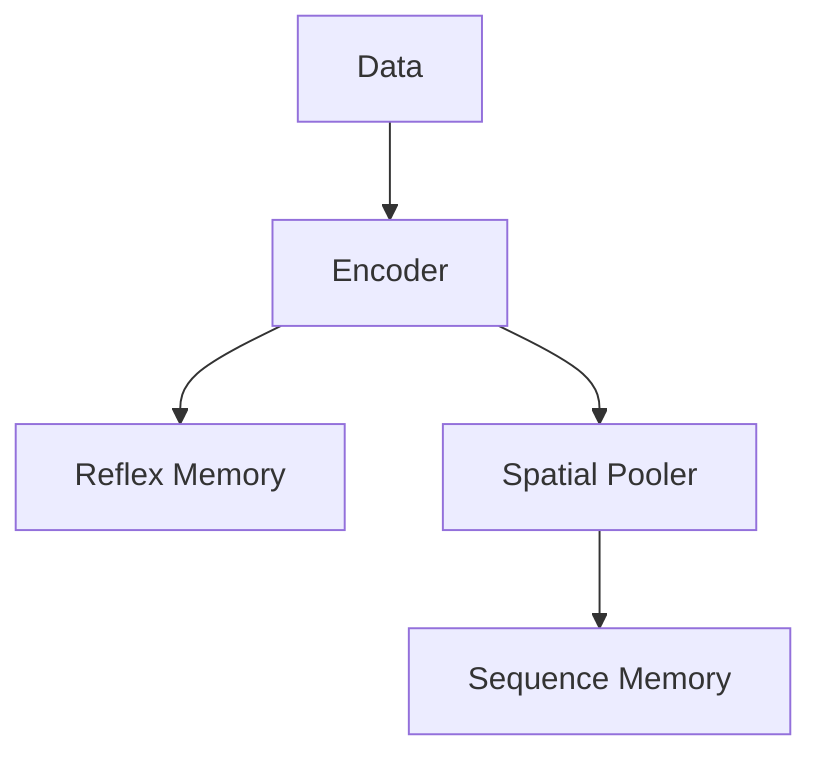
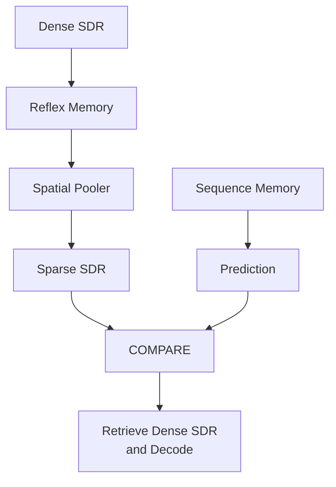
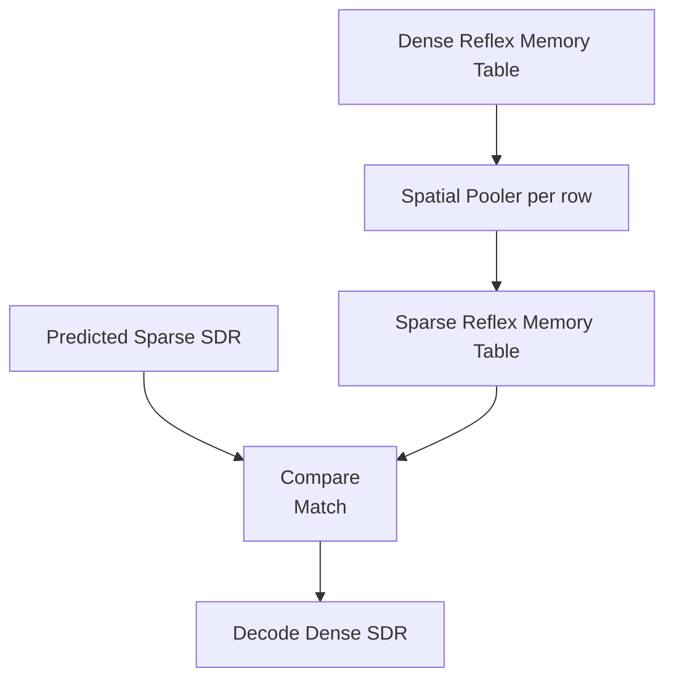

# Data Input Flow

# Reflex Memory

| SDR1    | SDR2 | Occurences | Last Accessed |
| -------- | ------- | ------- | ------- |
| dense_sdr_1 | dense_sdr_2 | count_1 | access_time_1 |
| dense_sdr_1 | dense_sdr_3 | count_2 | access_time_2 |
| dense_sdr_1 | dense_sdr_4 | count_2 | access_time_3 |

### An advantage of dense SDRs stored in reflex memory is that the data is still decodable. Spatial Pooler is a one-way function, so they are not decodable after this step. 

### Additionally, storing dense SDRs eliminates needing to wait for Spatial Pooler finish learning. If Spacial Pooler isn't done learning, the same input could get different sparse outputs. 

# Prediction Comparison Flow

# Prediction Scenarios

| SM | RM | Result |
| -------- | ------- | ------- |
| 0 | 0 | Penalize RM |
| 0 | 1 | Update SM permanences |
| 1 | 0 | High Penalty RM. Add SM to RM. |
| 1 | 1 | Update SM permanences |

# Decoding Flow

